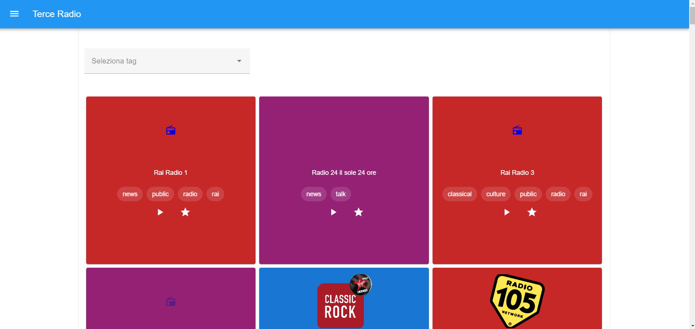
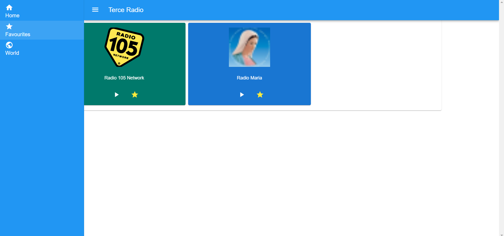
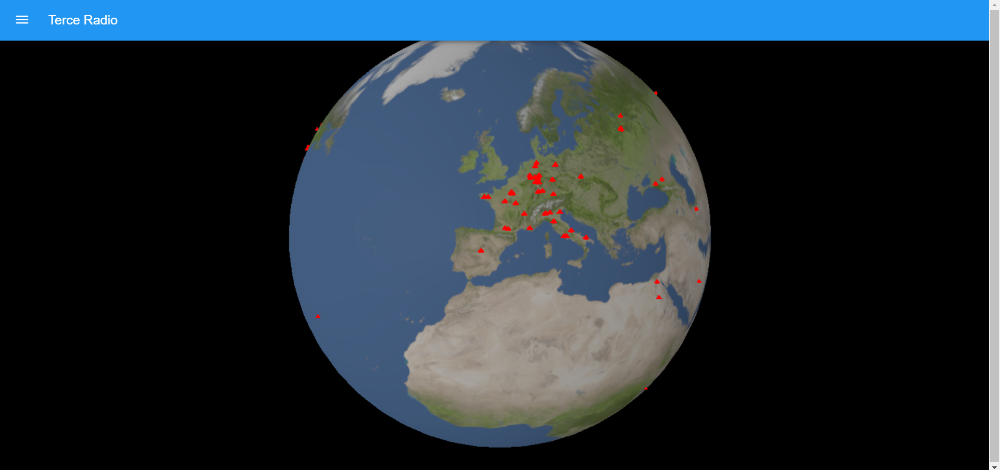
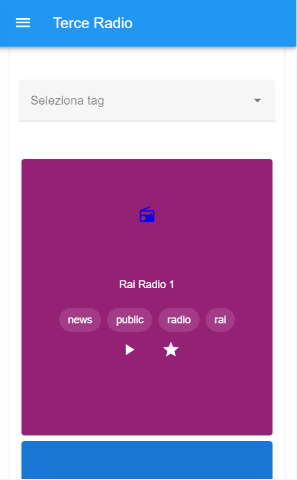

# RadioTerce

TerceRadio è un'applicazione web che ti consente di esplorare stazioni radio da tutto il mondo su un globo interattivo in 3D. Con TerceRadio, puoi scoprire nuove stazioni radio, aggiungere le tue preferite, esplorare stazioni per paese o regione e cercare stazioni per tag o genere musicale. La sua interfaccia intuitiva ti permette di navigare facilmente tra le stazioni e di goderti la tua musica preferita da ogni angolo del pianeta.

## Funzionalità Principali:

Esplorazione Globale: Esplora stazioni radio da tutto il mondo su un globo interattivo in 3D.
Preferiti: Aggiungi le tue stazioni radio preferite per accedervi facilmente in futuro.
Ricerca per Tag: Cerca stazioni radio per tag o genere musicale per trovare esattamente ciò che desideri ascoltare.
Tecnologie Utilizzate:

Vue.js: Framework JavaScript per la costruzione dell'interfaccia utente.
Three.js: Libreria JavaScript per la creazione di grafica 3D interattiva.
Hls.js: Libreria per la riproduzione di flussi HLS (HTTP Live Streaming).
API Radio-Browser: API per ottenere dati sulle stazioni radio da tutto il mondo.






## Project setup
```
npm install
```

### Compiles and hot-reloads for development
```
npm run serve
```

### Compiles and minifies for production
```
npm run build
```

### Lints and fixes files
```
npm run lint
```

### Customize configuration
See [Configuration Reference](https://cli.vuejs.org/config/).
